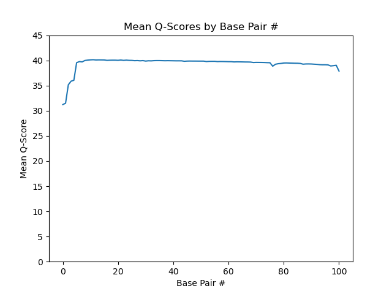
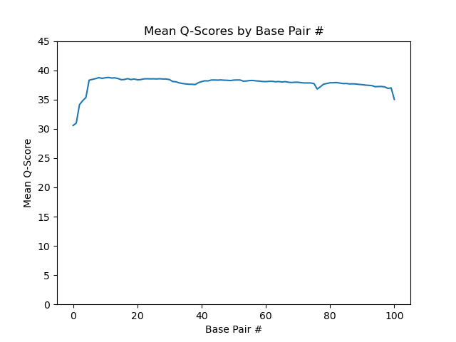
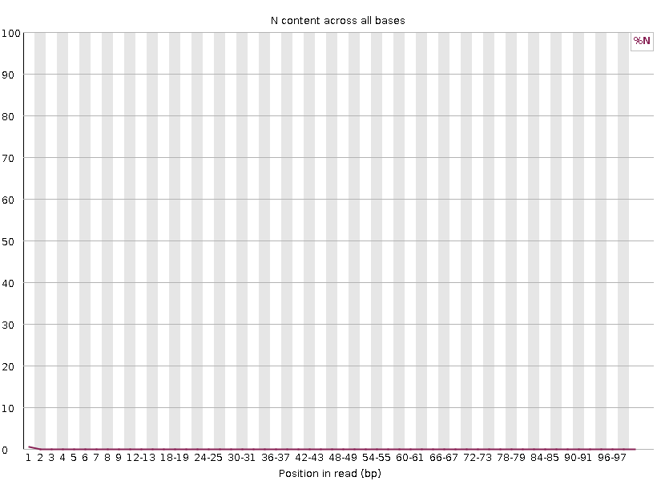
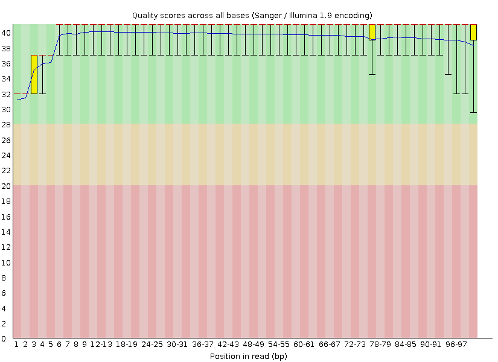
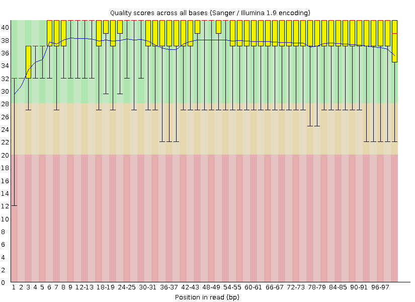
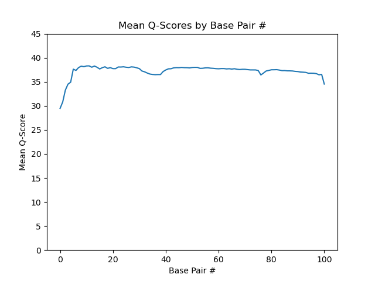

# Ramzy Al-Mulla QAA Assignment Report

## Part 1: Read Quality Distributions

### 22_3H_both_S16_L008_R1_001:
{width=310px} {width=310px}

### 22_3H_both_S16_L008_R2_001:
 ![22_3H R2 FASTQC Q-scores]{width=310px} (./22_3H_both_S16_L008_R2_001_fastqc/per_base_quality.png){width=310px}

### 23_4A_control_S17_L008_R1_001:
{width=310px} {width=310px}

### 23_4A_control_S17_L008_R2_001:
FASTQC
{width=310px} {width=310px}

Python
{width=310px}

## Part 2

{width=310px} {width=310px}

Demonstrate convincingly whether or not the data are from "strand-specific" RNA-Seq libraries. Include any comands/scripts used. Briefly describe your evidence, using quantitative statements (e.g. "I propose that these data are/are not strand-specific, because X% of the reads are y, as opposed to z.").

These data are most likely from strand-specific RNA-Seq libraries because the vast majority of mapped reads are
from 
