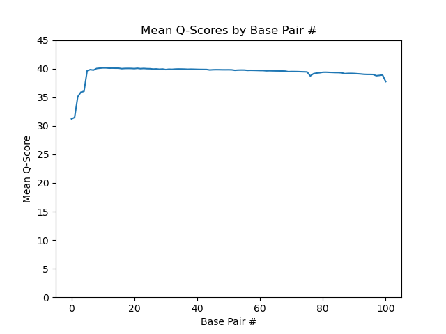
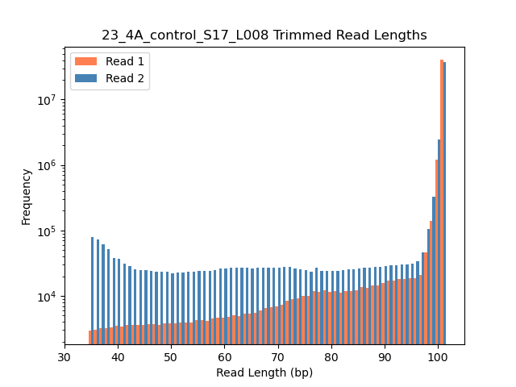

---
output:
  pdf_document: default
  html_document: default
---
# Ramzy Al-Mulla QAA Assignment Report

## Part 1: Read Quality Distributions

Below are the plots generated by FASTQC and my Qplotter.py script. The FASTQC 
plots took significantly less time to generate. For example, 23_4A read 1 took
just under 13 minutes using [mapcounts.py](./scripts/mapcounts.py), while 
FASTQC finished in only 3 minutes using roughly the same amount of CPU. The 
mean quality scores are more or less in agreement, at least visually.


### Figure 1: FASTQC and mapcount.py plots for each library. 
All libraries had reasonablly high mean quality scores, particularly at base pair #'s larger than 5. They also all had very low N content, indicating low ambiguity rates. This suggests the libraries are of sufficient quality to conduct futher analysis.

22_3H_both_S16_L008_R1_001:

FASTQC

{width=310px} {width=310px} 

Python 

{width=310px}

22_3H_both_S16_L008_R2_001:

FASTQC 

{width=310px} {width=310px}

Python 

{width=310px}

23_4A_control_S17_L008_R1_001:

FASTQC 

{width=310px} {width=310px}

Python

{width=310px}

23_4A_control_S17_L008_R2_001:

FASTQC 

{width=310px} {width=310px} 

Python 

{width=310px}


## Part 2

Adapter sequences were provided as:
Read 1 - AGATCGGAAGAGCACACGTCTGAACTCCAGTCA
Read 2 - AGATCGGAAGAGCGTCGTGTAGGGAAAGAGTGT

These were verified with the following bash commands:
```
$ zcat <read 1 file> | sed -n '2~4p' | grep --color=always "AGATCGGAAGAGCACACGTCTGAACTCCAGTCA" 
| head -n 100

$ zcat <read 2 file | sed -n '2~4p' | grep  --color=always "AGATCGGAAGAGCGTCGTGTAGGGAAAGAGTGT" 
| head -n 100

```

These showed that the adapters tend to be towards the end of the reads. Searching for truncted adapter sequences (e.g. "AGATCGGAAG" for read 2) showed them to be often truncted from the reads. This is expected because the adapters get sequenced as a result of the insert length being shorter than the read length, which implies that, when present, they would normally occur at the end of the read, often truncted.

### Figure 2: Trimmed Read Length Distributions
For both samples, read 2 were more extensively trimmed than read 1. I do not expect this to be due to adapter trimming, however, since both reads had similar numbers of sequences containing the full adapter. From the FASTQC quality plots (see figure 1), it appears that read 2 in both samples has substantially more variability in read quality. Thus, the difference between the trimmed length distributions of reads 1 and 2 is likely due to quality trimming rather than adapter trimming.

{width=310px} {width=310px}


## Part 3

Mapped Read Counts using [mapcount.py](./scripts/mapcount.py):

|               |   22_3H       |   23_4A    | 
| ------------- | ------------- |  --------- |
|    mapped     |   7,621,872   | 79,158,404 | 
|    unmapped   |   181,322     | 4,993,880  | 
|   total reads |   7,803,194   | 84,152,284 | 

Counts from htseq:

|               |   22_3H      | 23_4A      |
| ------------- |--------------|------------|
|    forward    |     142,603  | 1,324,268  |
|    reverse    |   3,370,858  | 32,827,759 |
| total mapped  |    3,513,461 | 34,152,027 |
| total reads   |    7,803,194 | 84,152,284 |


These data are most likely from strand-specific RNA-Seq libraries because for both samples approximately 96% of the mapped reads are from the --stranded=reverse htseq counts. In an unstranded library, the template and coding strands become jumbled up whilst undergoing PCR, meaning each read has essentially a 50/50 chance of being the template or the coding sequence. This means that, since htseq's forward or reverse strandedness inverts which read is treated as the 'template' when mapping to features, in an unstranded library one would expect a roughly equal number of mappings using --stranded=yes and --stranded=reverse. Therefore, since --stranded=reverse accounted for 96% of the mapped reads in both our samples, we can conclude that these data are from "strand-specific" RNA-seq libraries.

Additionally, the htseq-count documentation notes that erroneously using --stranded=yes or --stranded=reverse for an unstranded library will result in losing 50% of the reads. I ran htseq-count on the 22_3H_both_S16_L008 data using --stranded=no, which gave a mapped reads count of 3,264,753 out of 3,901,597 total reads (see bash commands below). If these data were from a strand-specific library, the forward and reverse htseq counts should both be around half that of the unstranded count, but in our case the reverse count is actually *greater* than than the unstranded. This further supports the conclusion that these are stranded libraries.

```
$ cat htseq_counts/htseq22-3H_uns.txt | grep -v '__' | awk '{sum+=$2} END {print sum}'
3264753
```
```
$ cat htseq22-3H_uns.txt | awk '{sum+=$2} END {print sum}'
3901597
```
